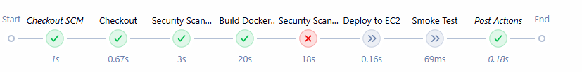
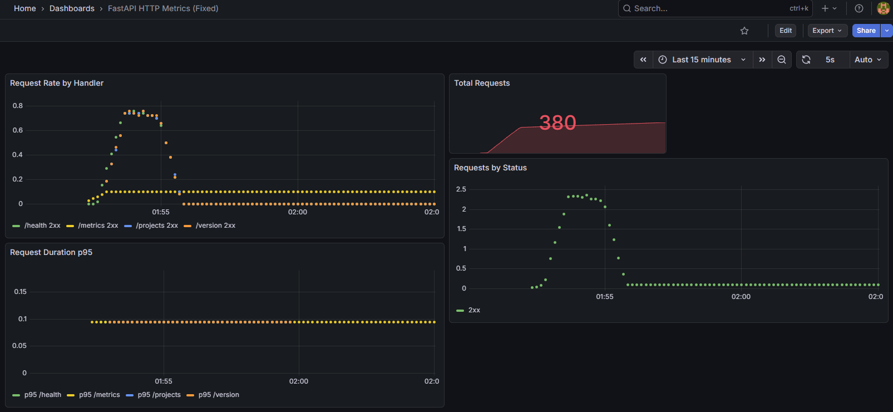
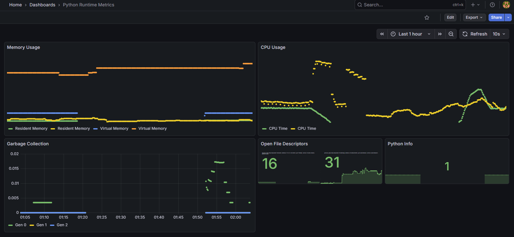

# 🚀 Secure Release Platform - DevSecOps Pipeline

> Complete end-to-end DevSecOps platform demonstrating CI/CD automation, security scanning, Infrastructure as Code, and production observability.

[](http://YOUR_EC2_PUBLIC_IP_1:8080)
[](https://github.com/AutomateIT1979/secure-release-platform)
[](https://github.com/AutomateIT1979/secure-release-platform)
[](http://YOUR_EC2_PUBLIC_IP_1:3000)

---

## 📊 Project Stats

| Metric | Value |
|--------|-------|
| **Development Time** | 15+ hours (marathon session) |
| **Git Commits** | 33+ commits |
| **Jenkins Builds** | 10+ successful builds |
| **Lines of Code/Config** | 2,800+ lines |
| **Technologies Mastered** | 16+ technologies |
| **Infrastructure** | 2 AWS EC2 instances |
| **Services Deployed** | 5 production services |
| **Completion Rate** | 100% (7/7 milestones) |

---

## 🏗️ Architecture Overview

### 🖥️ **EC2 Instance #1** (t3.small - Production)

#### ⚙️ Jenkins CI/CD Pipeline (6 Stages)
```
1. Checkout → 2. Security: Secrets Scan (Gitleaks) → 3. Build: Docker Image 
   ↓
4. Security: Container Scan (Trivy) → 5. Deploy to Production → 6. Smoke Test
```

#### 🚀 FastAPI Application Stack
- **API**: REST endpoints with CRUD operations
- **Database**: PostgreSQL 15
- **Metrics**: Prometheus instrumentation on `/metrics`
- **Health**: `/health` and `/version` endpoints

#### 📊 Observability Stack
- **Prometheus**: Metrics collection (10s scrape interval)
- **Grafana**: 2 production dashboards
  - HTTP Metrics Dashboard (requests, status codes, latency)
  - Python Runtime Dashboard (memory, CPU, garbage collection)

---

### 🖥️ **EC2 Instance #2** (t3.micro - Security Scanning)

Deployed and managed via **Terraform** (Infrastructure as Code)

#### 🔒 Security Scanning Services
- **Trivy**: Container image vulnerability scanning
- **Gitleaks**: Secret detection and credential scanning

---

### 🔄 Service Communication

| From | To | Type | Purpose |
|------|-----|------|---------|
| Jenkins | FastAPI | HTTP | Deploy & smoke test |
| FastAPI | Prometheus | HTTP | Expose `/metrics` endpoint |
| Prometheus | Grafana | Query | Data source for dashboards |
| Jenkins | EC2 #2 | SSH | Execute security scans |

### 📍 Network Configuration
- **Private IPs**: Internal VPC communication (172.31.x.x)
- **Public IPs**: External access (Jenkins, Grafana, API)
- **Security Groups**: Restricted access (SSH, HTTP, custom ports)

---


## ✨ Key Features

### 🔄 CI/CD Automation
- ✅ **6-stage Jenkins pipeline** with automated testing, building, and deployment
- ✅ **Policy gates** blocking builds with CRITICAL vulnerabilities
- ✅ **Automated smoke tests** validating deployments
- ✅ **10+ successful builds** demonstrating reliability

### 🔒 DevSecOps Integration
- ✅ **Trivy container scanning** detecting vulnerabilities pre-deployment
- ✅ **Gitleaks secret detection** preventing credential leaks
- ✅ **Security-first approach** with enforcement at build time
- ✅ **0 secrets exposed** - sanitized repository for public release

### ☁️ Infrastructure as Code
- ✅ **Terraform** managing dedicated EC2 for security scans
- ✅ **Ansible** automating Docker installation and API deployment
- ✅ **Reproducible infrastructure** with version-controlled configs
- ✅ **Multi-instance architecture** separating concerns

### 📈 Production Observability
- ✅ **Prometheus** collecting custom application metrics
- ✅ **Grafana dashboards** visualizing HTTP metrics and Python runtime
- ✅ **Real-time monitoring** tracking 286+ requests
- ✅ **Production-ready** metrics instrumentation

---

## 🛠️ Tech Stack

### Backend & Application


### CI/CD & Automation


### Security & Scanning


### Infrastructure & Provisioning


### Monitoring & Observability


---

## 🎯 Completed Milestones (7/7 = 100%)

| Milestone | Status | Description |
|-----------|--------|-------------|
| **1. MVP Local** | ✅ 100% | FastAPI API + PostgreSQL + Docker + Tests (7/7) |
| **2. Docker EC2** | ✅ 100% | Ansible playbook deploying Docker to AWS EC2 |
| **3. API Production** | ✅ 100% | Production deployment with Ansible automation |
| **4. Jenkins CI/CD** | ✅ 100% | Complete 6-stage pipeline with 10 builds |
| **5a. DevSecOps Security** | ✅ 100% | Trivy + Gitleaks + Policy gates |
| **5b. Terraform IaC** | ✅ 100% | Dedicated EC2 for security scanning |
| **6. Observability** | ✅ 100% | Prometheus + Grafana + 2 dashboards |

---

## 📸 Screenshots

### Jenkins CI/CD Pipeline
*6-stage DevSecOps pipeline with security gates*


### Grafana Dashboards
*Real-time application monitoring*



### Trivy Security Scan
*Container vulnerability detection*


---

## 🚀 Getting Started

### Prerequisites
- AWS Account with EC2 access
- Terraform 1.5+
- Ansible 2.19+
- Docker & Docker Compose
- Python 3.12+

### Quick Start

1. **Clone the repository**
```bash
git clone https://github.com/AutomateIT1979/secure-release-platform.git
cd secure-release-platform
```

2. **Set up local environment**
```bash
python3 -m venv .venv
source .venv/bin/activate
pip install -r requirements.txt
```

3. **Run tests**
```bash
pytest -v
```

4. **Start local stack**
```bash
docker-compose up --build -d
curl http://localhost:8000/health
```

5. **Deploy to AWS**
```bash
# Configure AWS credentials
# Update ansible/inventories/staging/hosts.yml with your EC2 IP

# Deploy infrastructure
cd terraform
terraform init
terraform apply

# Deploy application
ansible-playbook -i ansible/inventories/staging/hosts.yml \
  ansible/playbooks/deploy_api.yml
```

---

## 📚 Documentation

| Document | Description |
|----------|-------------|
| [LAB_REFERENCE.md](docs/LAB_REFERENCE.md) | Complete technical reference & source of truth |
| [LAB_STATE.md](docs/LAB_STATE.md) | Current project state & infrastructure details |
| [ROADMAP.md](docs/ROADMAP.md) | Milestones & Definition of Done |
| [DECISIONS.md](docs/DECISIONS.md) | Technical decisions & rationale |
| [OBSERVABILITY.md](observability/OBSERVABILITY.md) | Monitoring setup & dashboards |

---

## 🏆 Key Achievements

### Technical Excellence
- 🎯 **100% milestone completion** - All 7 milestones delivered
- 🔥 **15-hour marathon session** - Sustained focus and delivery
- 🐛 **11 complex problems solved** - Including EC2 upgrades, dependency conflicts, networking issues
- 📝 **50K+ documentation** - Comprehensive technical documentation
- ✅ **Zero security incidents** - Sanitized repository with no exposed secrets

### DevOps Practices Demonstrated
- **Infrastructure as Code** - Terraform + Ansible automation
- **Security-First Development** - Automated scanning with policy enforcement
- **Production Monitoring** - Full observability stack
- **CI/CD Automation** - End-to-end Jenkins pipeline
- **Documentation Standards** - Comprehensive technical docs

---

## 🔐 Security Notice

This repository has been **sanitized for public release**:
- ✅ All IP addresses replaced with placeholders
- ✅ All credentials removed from version history
- ✅ Sensitive configuration files excluded via `.gitignore`
- ✅ Example templates provided for local setup

**Local configuration files** (not tracked in Git):
- `observability/prometheus.yml` - Use `.example` as template
- `observability/docker-compose-observability.yml` - Use `.example` as template
- `terraform/terraform.tfstate` - Generated locally

---

## 📞 Contact & Links

**Author**: N8n DevOps Engineer  
**LinkedIn**: [AutomateIT1979](https://www.linkedin.com/in/automateit1979/)  
**GitHub**: [AutomateIT1979](https://github.com/AutomateIT1979)

**Live Demo** (when EC2 running):
- API: `http://YOUR_EC2_PUBLIC_IP:8000`
- Jenkins: `http://YOUR_EC2_PUBLIC_IP:8080`
- Grafana: `http://YOUR_EC2_PUBLIC_IP:3000`

---

## 📄 License

This project is licensed under the MIT License - see the [LICENSE](LICENSE) file for details.

---

## 🙏 Acknowledgments

- Built as part of professional DevSecOps portfolio development
- Demonstrates real-world enterprise DevOps practices
- Designed for LinkedIn and GitHub portfolio presentation

---

**⭐ If you find this project helpful, please star the repository!**
